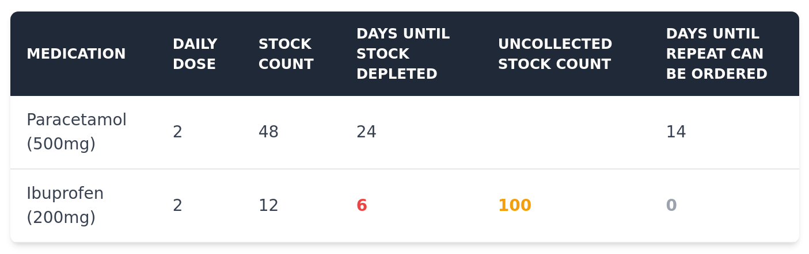

# nhs-prescription-calendariser

Interrogates the 'EMIS Patient Access' prescriptions system and generates a report showing: medications that are running low; prescriptions that have changed; and prescriptions which are due for a repeat request.

https://www.patientaccess.com/

## Why?

This is a personal project to help track medications for a family member, and to ensure that repeat prescriptions are issued and collected in good time.

## How to use

What is here works for me, but is very rough and ready. If you do wish to play with this, please bear the following in mind:

- You'll need to update the example files in the `configuration` folder to match the Repeat Prescriptions that are available for your EMIS Patient Access account.
  - The medication names used should be identical to those in Patient Access.
    - _(I am pretty confident, now, that the ID assigned to these medications endures and is consistent across API requests. Maybe, one day, I'll update this all to use that instead... maybe...)_
  - **_Please be careful not to accidentally commit private medication details to a public Repo,_** unless you are happy to do this.
- You'll need to have a [Deno](https://deno.com/) environment installed (which I would heartily recommend anyway).
- `deno task start`, run from the `reportGeneration` folder, will:
  - kick off a Playwright harness that prompts you to log in to the Patient Access site.
    - This is to obtain an Access Token which is used for subsequent API requests.
    - The Access Token lasts for ten minutes.
  - make API requests that interrogate the status of repeat prescriptions.
  - build a report.
- `deno task report` will run the report generation part of this only... useful for when you want to see an up-to-date stock count without having to account for any new prescription issues.  
- Although I have not found anything that explicitly forbids use of these services in this manner, please be aware that this API-driven access is unlikely to be an intended use case. **_Proceed at your own risk._**

## Example Report

This is the sort of thing you can expect to see as a result:

